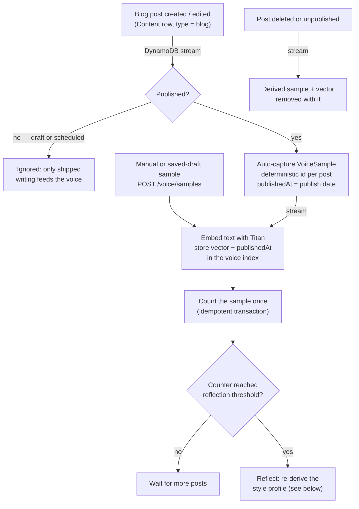
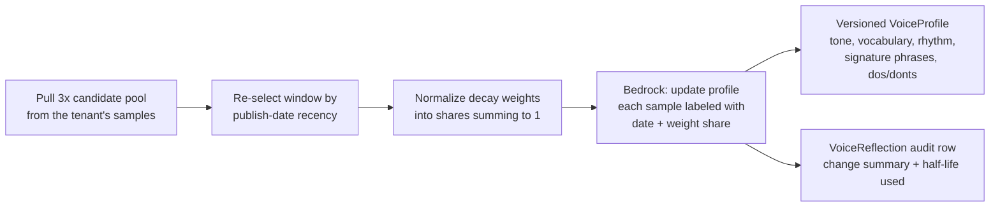
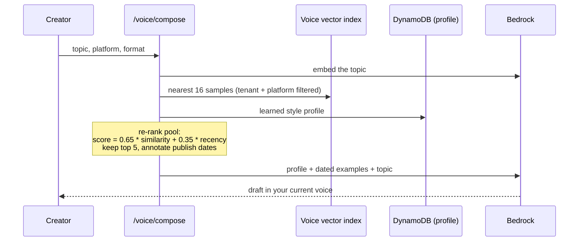
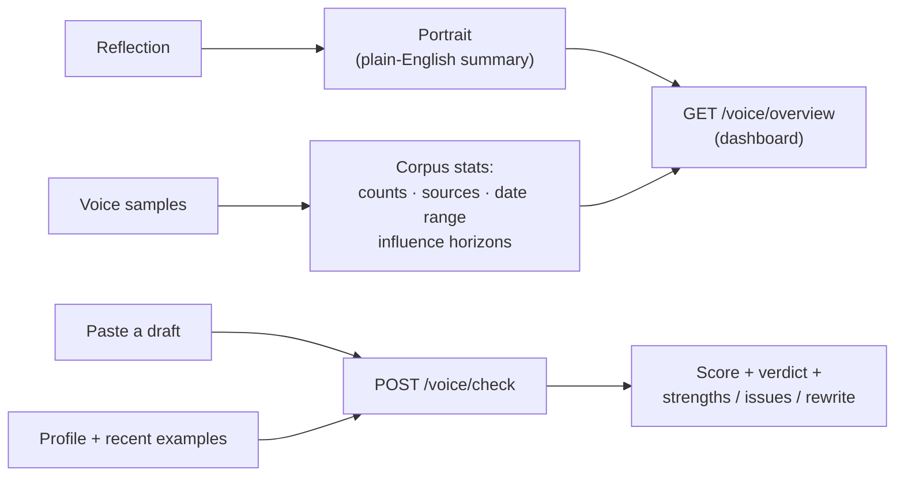

# Booked

Influencer analytics aggregator backend. Owns Campaign, Vendor, and Link
metadata plus revenue tracking. Delegates short-link minting and redirect
tracking to [`readysetcloud/newsletter-service`](https://github.com/readysetcloud/newsletter-service),
which captures clicks and publishes per-code analytics that this stack
consumes for campaign-level rollups.

## Architecture overview

- Single AWS SAM stack (`template.yaml`) deployed to one of two
  environments: `staging` or `production`.
- All routes are authenticated by the shared `RSCUserPool` Cognito user
  pool, published by the [`readysetcloud/rsc-core`](https://github.com/readysetcloud/rsc-core)
  stack. The pool ARN is resolved from SSM at deploy time
  (`/readysetcloud/auth/user-pool-arn`).
- DynamoDB single-table store (`pk` + `sk`) holds Campaigns, Links,
  Social posts, Vendors, and the campaign-by-vendor index.
- API Gateway REST API defined by `publicapi.yaml`. Lambda integrations
  use the `aws_proxy` type and run Node.js 24 on arm64.
- Newsletter-service integration is pull-only: this stack reads
  newsletter-service's published SSM parameters to discover its API base
  URL and the short-link host, and calls newsletter-service's mint and
  analytics endpoints from inside its Lambdas.

A companion Chrome extension (`extension/`) signs in through the same
Cognito pool, reads the social post URLs on active campaigns, and as you
browse those posts on X/Twitter, LinkedIn, and Instagram it captures
engagement off each platform's own traffic and writes it back via
`PUT /campaigns/{id}/social-posts/{postId}/analytics`. See
[`extension/README.md`](extension/README.md).

Dashboard work is tracked separately.

## Voice: recency-weighted style learning & synthesis

The Voice feature learns how you write (per tenant, per platform) and drafts
new content that sounds like you. Its core idea: **your voice is what you
sound like *now***, so every signal is weighted by publish date — the most
recently published post always speaks loudest, and the learned profile evolves
as your writing does. Full design rationale lives in
[`docs/voice-recency.md`](docs/voice-recency.md).

### 1. Capture — every published blog post feeds the voice automatically

Registering or editing a published blog post is all it takes. A DynamoDB
stream consumer (`VoiceMemoryFunction`) watches blog content rows and turns
each published piece into a voice sample anchored on its publish date. No
manual step, and everything stays inside the tenant's own partition.



Edits re-embed the sample and count as fresh voice signal; deleting or
unpublishing a post takes its sample with it, so the corpus always mirrors
what is actually published.

### 2. The recency model — exponential publish-date decay

Every sample's influence decays exponentially with the age of its publish
date (the continuous form of an exponentially-weighted moving average):

```
weight = 0.5 ^ (ageInDays / halfLifeDays)        # halfLifeDays default: 90
```

With the default 90-day half-life:

| Published | Weight | Relative influence |
| --- | --- | --- |
| today | 1.00 | `████████████████████` |
| 1 month ago | 0.79 | `████████████████` |
| 3 months ago | 0.50 | `██████████` |
| 6 months ago | 0.25 | `█████` |
| 1 year ago | 0.06 | `█` |
| 2 years ago | 0.004 | `▏` |

Smooth and never zero — old posts fade rather than falling off a cliff. One
interpretable knob (`VoiceHalfLifeDays` template parameter) controls how fast
the voice "moves on"; samples with no known date get a neutral 0.5, and
future-dated (scheduled) posts clamp to 1. Implementation:
[`api/services/voice-recency.mjs`](api/services/voice-recency.mjs).

### 3. Reflection — the profile evolves toward the current voice

Every N new samples (`ReflectionThreshold`, default 5) — or on demand via
`POST /voice/profiles/{platform}/reflect` — the style profile is re-derived:



The reflection prompt is explicit about the physics: **when samples disagree
— tone shifted, formatting habits changed, vocabulary moved on — the
higher-weighted recent posts win**; traits from older posts survive only
while nothing newer contradicts them. Each reflection is recorded with the
half-life it ran with, so profile drift stays explainable.

### 4. Synthesis — composing in your current voice

`POST /voice/compose` (and its streaming twin) grounds generation in both
memories — the learned profile (semantic) and real past posts (episodic) —
with recency biasing which posts get used as few-shot examples:



A recently published near-match outranks a stale exact match, and the compose
prompt tells the model to favor the most recently published examples when
styles conflict — so drafts sound like you write today, not like your
back catalog's average.

### 5. Reading your voice back — portrait, overview, and draft-check

The learned voice isn't just a JSON blob the model consumes; it's surfaced so a
person can understand and use it directly.

- **Plain-English portrait.** Every reflection also writes a `portrait` — a
  vivid 2-4 sentence description of how you write now ("You open with a blunt
  claim, then earn it with a concrete example…"), stored on the profile and
  shown at the top of the voice page. It's the human-readable answer to "what
  has the system actually learned about my voice?"

- **`GET /voice/overview`** — one call returns, for every platform you have a
  voice on: the portrait, and full corpus transparency — how many samples, from
  which sources, over what published date range, and the recency math made
  legible as *influence horizons* ("posts from the last 90 days shape 71% of
  your current voice"). This is the flagship read that powers the dashboard.

- **`POST /voice/check`** — paste any draft and get an on-voice score (0-100), a
  verdict, plain-English feedback, concrete off-voice issues with fixes, and an
  optional rewrite. It runs the same recency-weighted retrieval as compose, but
  grades against your voice instead of writing — so the tool both *generates*
  and *evaluates* in your voice.



### 6. Curating and steering the voice

The voice is only as good as the memories behind it, so those memories are
yours to control — and you can point the evolution where you want it to go.

- **See what drives the voice.** Every sample in `GET /voice/samples` carries an
  `influence_share` — the recency weight it currently holds ("this post = 18% of
  your voice"), so you can see exactly which memories dominate.

- **Mute a memory.** `PATCH /voice/samples/{id} { muted }` excludes a sample
  from the voice while keeping it for reference. Muting a published post is
  **durable** — a later edit to that post won't quietly bring it back. Curation
  re-derives the profile immediately, so removal takes effect at once.

- **No self-training.** Reflection ignores AI-generated drafts, so the model can
  never teach your voice about itself — only work you actually authored defines
  how you sound.

- **Steer it.** `PUT /voice/profiles/{platform}/steering` stores a short intent
  note ("more concise, less hedging") that biases the next reflection toward
  where you're taking your voice — direction, not just observation.

- **Watch it evolve.** Each reflection snapshots the profile version and
  portrait, so the reflection list reads as a "your voice over time" timeline.

### Tuning knobs

| Knob | Where | Default | Effect |
| --- | --- | --- | --- |
| `VoiceHalfLifeDays` | template parameter | 90 | Lower = the voice tracks recent posts more aggressively |
| `VOICE_RECENCY_BLEND` | env var | 0.35 | 0 = rank compose examples purely by topic similarity, 1 = purely by recency |
| `ReflectionThreshold` | template parameter | 5 | New samples per platform before an automatic re-reflection |

To backfill the voice from an existing catalog (with real publish dates), run
[`scripts/seed-voice-from-content.mjs`](scripts/seed-voice-from-content.mjs)
once per environment — dry-run by default, `--apply` to write.

## Resources created

The SAM stack provisions:

- 1 DynamoDB table (`ContentTrackingTable`) with point-in-time recovery
  enabled and on-demand billing.
- 1 API Gateway REST API (`ContentTrackingApi`) on stage `v1`.
- 13 Lambda functions:
  - `CreateCampaignFunction` (`POST /campaigns`)
  - `GetCampaignFunction` (`GET /campaigns/{campaignId}`)
  - `GetCampaignAnalyticsFunction` (`GET /campaigns/{campaignId}/analytics`)
  - `UpdateCampaignPayoutFunction` (`PATCH /campaigns/{campaignId}/payout`)
  - `CreateCampaignLinkFunction` (`POST /campaigns/{campaignId}/links`)
  - `GetCampaignLinkAnalyticsFunction` (`GET /campaigns/{campaignId}/links/{linkId}/analytics`)
  - `GetRevenueFunction` (`GET /revenue`)
  - `CreateVendorFunction` (`POST /vendors`)
  - `ListVendorsFunction` (`GET /vendors`)
  - `GetVendorFunction` (`GET /vendors/{vendorId}`)
  - `UpdateVendorFunction` (`PUT /vendors/{vendorId}`)
  - `DeleteVendorFunction` (`DELETE /vendors/{vendorId}`)
  - `ListVendorCampaignsFunction` (`GET /vendors/{vendorId}/campaigns`)

Stack outputs include `ContentTrackingApiBaseUrl` and
`ContentTrackingTableName` for downstream tooling.

## Quick start

```bash
npm install
npm test
sam build
sam deploy --guided
```

`sam deploy --guided` walks you through the first deploy and writes the
chosen values to `samconfig.toml`. The `NewsletterMintApiKey` parameter is
required and has no default. See [`docs/deploy-guide.md`](docs/deploy-guide.md)
for the full walkthrough, including cross-stack prerequisites and CI/CD.

## How it connects to newsletter-service

This stack consumes three published values from newsletter-service plus
one shared secret:

| Value | Source | Purpose |
| --- | --- | --- |
| `/newsletter-service/{env}/newsletter-api-base-url` | SSM (newsletter-service) | Base URL the Lambdas call for mint and per-link analytics. In production this resolves to `https://api.newsletter.readysetcloud.io`. |
| `/newsletter-service/{env}/campaign-short-link-base` | SSM (newsletter-service) | Public host for minted short links (for example `https://rdyset.click/c`). Surfaced in API responses. |
| `NEWSLETTER_MINT_API_KEY` | Deploy parameter (secret) | Authenticates calls to newsletter-service's mint endpoint. Must match the value newsletter-service was deployed with. |

`{env}` is `staging` or `production`. Both stacks must be deployed to
the same environment for the wiring to resolve.

## Auth

Every route requires an `Authorization` header containing a Cognito
access token issued by the `RSCUserPool` user pool. The pool ARN is
read from SSM (`/readysetcloud/auth/user-pool-arn`) at deploy time and
wired into API Gateway as a `cognito_user_pools` authorizer.

Every API route requires authentication; there are no API keys. The one
public surface is the **published media kit**: a creator can publish a
brand-facing teaser to a stable vanity URL
(`https://kit.<domain>/<slug>`) that is served anonymously from a
dedicated public bucket + CloudFront distribution. Generating and
publishing it are still Cognito-gated — only the resulting static page is
public, and it deliberately omits rate-card pricing.

## Deeper docs

- [`docs/deploy-guide.md`](docs/deploy-guide.md) - prerequisites,
  cross-stack SSM dependencies, local-dev deploy, CI/CD via GitHub
  Actions, OIDC role setup.
- [`docs/api-reference.md`](docs/api-reference.md) - every route, every
  schema, status codes and example payloads.
- [`docs/voice-recency.md`](docs/voice-recency.md) - the recency-weighted
  voice model: why exponential publish-date decay, where the weighting
  applies, and how to tune it.
