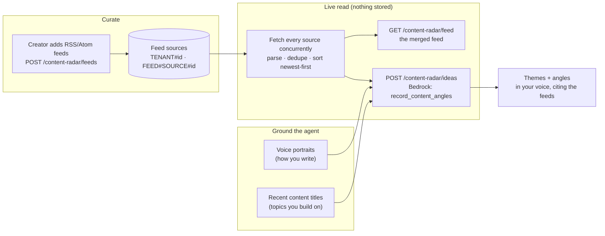

# Content Radar: customizable RSS feeds → content angles in your voice

Content Radar turns "what's the wider world publishing right now?" into "what
should *I* publish about it?" — a customizable RSS/Atom feed the creator
curates, read by an AI agent that proposes content angles which follow **this
creator's** voice and build on the topics they already cover.

It's the outward-looking companion to the [Voice](voice-recency.md) feature.
Voice learns how you write and drafts in it; Content Radar watches what the
world is saying and finds the openings where the current conversation overlaps
your lane.

## The shape of it

## Design decisions

### Only the source list is persisted; the feed is always live

A feed source (`pk = TENANT#{tenantId}`, `sk = FEED#SOURCE#{feedId}`) is the
only stored entity, mirroring the tenant-partition isolation of
[`blog.mjs`](../api/domain/blog.mjs) and [`voice.mjs`](../api/domain/voice.mjs) —
the `tenantId` is the Cognito `sub` from the authorizer, never the client, so a
handler can only ever touch its own partition.

Feed **items** are fetched on demand and never stored. The "feed" is a live
aggregation, so there's no cache to invalidate, no backfill, no expiry, and it
can't go stale. The cost is a fan-out of HTTP GETs per read; a creator follows a
handful of feeds (personal-scale), so that's cheap and bounded.

### The parser is dependency-free and defensive

[`services/rss.mjs`](../api/services/rss.mjs) parses RSS 2.0 / RDF / Atom with a
few targeted regex passes rather than an XML library — the same tack
[`content-fetch.mjs`](../api/services/content-fetch.mjs) takes for HTML. Feeds
are noisy but their item structure is simple and stable.

Everything is best-effort. A feed that 404s, times out, returns HTML instead of
XML, or is malformed contributes nothing to the aggregate and is reported as
failed (`sources[n].ok = false`) so the UI can flag it — one broken source never
sinks the read (`Promise.allSettled`). Fetches are bounded (8s timeout, ~5 MB
cap, 50 items/feed) and reuse the SSRF guard (`isPublicHttpUrl`) so a
user-supplied feed URL can't be pointed at an internal/metadata target.

Items are de-duplicated (the same story often appears in overlapping feeds,
keyed by guid → link → title) and sorted newest-first by publish date.

### Idea generation grounds the agent in three signals

`POST /content-radar/ideas` doesn't just summarize the feed — it forces a
Bedrock tool call (`record_content_angles`) with three grounding inputs so the
angles are *yours*, not generic:

1. **What the feeds are publishing now** — the aggregated items, numbered so the
   model cites them (`sources: [n]`). Angles trace back to the live conversation.
2. **How you write** — your learned [voice](voice-recency.md) portraits (the
   plain-English summaries from every platform profile). The agent writes titles
   and takes in your style.
3. **What you build on** — your recent content titles, so the best angles sit
   where the current conversation overlaps the lane you're already in.

The voice and topics reads are best-effort context: a cold-start creator with
neither still gets general angles from the feeds. Only the feed read is
required — with no sources, the endpoint returns `400` telling you to add feeds.

Like `POST /voice/compose`, nothing is persisted — regenerating is a fresh read.
The prompt is explicit that trending-but-off-voice ideas are weak, that angles
must be fresh takes (never "just reshare this item"), and favors 4-8 strong
distinct angles over a long generic list.

### Health is advisory and never fails the read

After each aggregation the per-source outcome is stamped back onto the source
row (`lastStatus`, `lastError`, `lastFetchedAt`, `lastItemCount`) so the UI can
show which feeds are healthy. These writes run concurrently and swallow failures
(`recordFeedFetch` is conditional on the row still existing) — health tracking
rides along with the read it describes and must never fail it.

## Endpoints

See [`docs/api-reference.md`](api-reference.md#content-radar) for full request
and response shapes.

| Method & path | Purpose |
| --- | --- |
| `POST /content-radar/feeds` | Add a feed source (`{ url, title? }`) |
| `GET /content-radar/feeds` | List feed sources (with health) |
| `PATCH /content-radar/feeds/{feedId}` | Rename / mute a source |
| `DELETE /content-radar/feeds/{feedId}` | Remove a source |
| `GET /content-radar/feed` | The live aggregated feed |
| `POST /content-radar/ideas` | Generate content angles in your voice |

## Where the code lives

| Concern | Module |
| --- | --- |
| Fetch + parse + aggregate feeds | [`api/services/rss.mjs`](../api/services/rss.mjs) |
| Feed source store (per-tenant CRUD + health) | [`api/domain/feed.mjs`](../api/domain/feed.mjs) |
| Validation + response formatting | [`api/validation/feed.mjs`](../api/validation/feed.mjs) |
| Routes | [`api/routes/feeds.mjs`](../api/routes/feeds.mjs) |
| Content-angles Bedrock pipeline | `suggestContentAngles` in [`api/services/bedrock.mjs`](../api/services/bedrock.mjs) |
| UI client | [`ui/src/api/contentRadar.ts`](../ui/src/api/contentRadar.ts) |

All routes run through the single `ApiFunction` Lambda (the Powertools Router
dispatches by method + path), so no per-route API Gateway or template wiring is
needed. Idea generation reuses the API function's existing Bedrock permissions.
